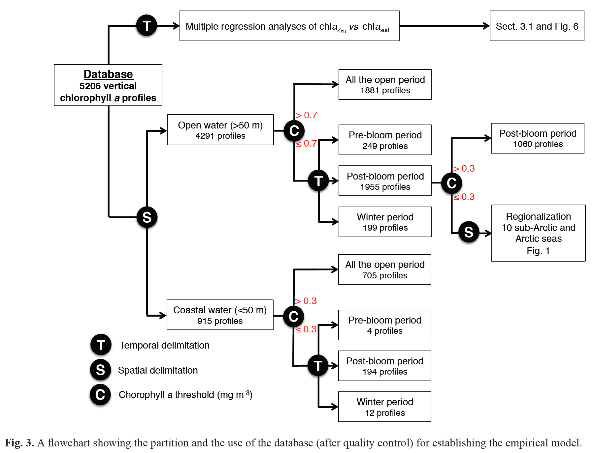

```{r setup, include=FALSE}
options(htmltools.dir.version = FALSE)
knitr::opts_chunk$set(
  comment = "#>",
  collapse = TRUE,
  cache = TRUE,
  out.width = "80%",
  fig.align = "center",
  fig.width = 6,
  fig.asp = 0.618, # 1 / phi
  fig.show = "hold",
  dev = "png",
  dpi = 600,
  message = FALSE,
  warning = FALSE,
  echo = FALSE
)
library(tidyverse)
library(ggpmthemes)
library(fontawesome)
library(knitr)
library(kableExtra)
library(patchwork)
library(ggtext)
library(sf)
library(ggforce)

theme_set(theme_poppins(base_size = 16))
```

```{r xaringan-themer, include=FALSE}
library(xaringanthemer)
duo(
  code_font_family = "Fira Code",
  code_font_url = "https://cdn.rawgit.com/tonsky/FiraCode/1.204/distr/fira_code.css",
  text_font_google = google_font("Questrial"),
  inverse_background_color = "#ABB7B7",
  inverse_text_color = "#3c3c3c",
  inverse_header_color = "#3c3c3c",
  background_color = "#3c3c3c",
  header_color = "#B2CCE5",
  title_slide_text_color = "#3c3c3c",
  title_slide_background_color = "#ABB7B7"
  # Yanone Kaffeesatz
)
```

class: my-one-page-font, inverse, center, middle

# Primary production in the Arctic

A brief presentation of the laster primary production model developed at Takuvik

---

# Modeling primary production

Daily primary production $(mgC~m^{-2}~d^{-1})$ can be *easily* calculated as follows:

\begin{equation}
\text{PP} = P^B_{\text{max}}\int_{t~=~0}^{24h}\int_{z~=0}^{z_\text{max}}\text{Chl a}(z)[1-e^{\frac{-\text{PUR}(z,t)}{E_k\text{PUR}(z)}}]\,\mathrm{d}t\mathrm{d}z
\end{equation}

**Important to have proper values/estimates of Chl *a*.**

--

But why do we need another primary production model 🤔

---

# Estimating Chl *a* in the water column

- Ocean color (OC) satellite sensors can only detect surface Chl *a*.

- Can not detect subsurface chlorophyll maxima (SCMs) that can significantly contribute to areal primary production in the Arctic Ocean (Hill et al., 2005; Weston et al., 2005; Martin et al., 2010).

- Hence, **SCMs are generally omitted from PP estimates based on OC remote sensing.**

---

# Subsurface chlorophyll maxima (SCMs)

```{r scm1}

# 0.2765 0.0002 1.578 37.94 20.73

cb <- 0.2765
s <- 0.0002
cmax <- 1.578
zmax <- 37.94
dz <- 20.73

z <- seq(0, 150, by = 0.1)

chla <- cb - s * z + cmax * exp(-((z - zmax) / dz)^2)

p <- tibble(z, chla) %>%
  ggplot(aes(x = chla, y = z)) +
  geom_path(size = 2) +
  scale_y_reverse() +
  geom_hline(
    yintercept = zmax,
    lty = 2,
    color = "gray50",
    size = 1
  ) +
  labs(
    x = "Normalized Chl a",
    y = "Depth (m)"
  )

p
```

---

# Subsurface chlorophyll maxima (SCMs)

```{r scm2}
p +
  geom_mark_circle(aes(
    filter = z == 0,
    label = "What is seen\nby the satellite"
  ),
  expand = unit(3, "mm"),
  label.family = "Aldrich"
  ) +
  geom_mark_circle(aes(
    filter = chla == max(chla),
    label = "What is missed\nby the satellite"
  ),
  expand = unit(3, "mm"),
  label.family = "Aldrich"
  )
```

---

# Parameterization of vertical chl *a* in the Arctic Ocean

The study of Ardyna et al. 2013 tackled the problem of characterizing the SCMs in the Arctic.

> In the Arctic Ocean, deep subsurface chlorophyll maxima (SCMs) that significantly contribute to primary production (PP) are often observed. These are neither detected by ocean color sensors nor accounted for in the primary production models applied to the Arctic Ocean.
>
> — *Ardyna et al., 2013*

---

class: my-one-page-font, inverse, center, middle

# The primary production model

Taking into account the vertical variations in Chl *a*.

---

# How to model Chl *a* vertical profile?

Ardyna et al. proposed to parameterize the vertical Chl *a* profiles using a Gaussian-based equation:

\begin{equation}
c(z) = C_b - sz + C_{\text{max}}e^{-(\frac{z - Z_{\text{max}}}{\Delta z})^2}
\end{equation}

--

How to estimate the parameters $C_b, s,  C_{\text{max}},  Z_{\text{max}}$?

---

# How to model Chl *a* vertical profile?

Parameter values determine the shape of the SCMs.

```{r scm3, out.width= "70%", fig.height=5, fig.width=8, fig.asp=NA}
n <- 10
cb <- seq(0.09, 1.17, length.out = n)
s <- seq(0.0001, 0.0026, length.out = n)
cmax <- seq(0.11, 2.15, length.out = n)
zmax <- seq(0, 83.42, length.out = n)
dz <- seq(18.45, 80.52, length.out = n)

z <- seq(0, 150, by = 1)

# crossing(cb, s, cmax, zmax, dz) %>% 
tibble(cb, s, cmax, zmax, dz) %>% 
  rowid_to_column() %>%
  group_nest(rowid) %>% 
  mutate(z = list(z)) %>% 
  unnest(c(data, z)) %>% 
  group_nest(rowid) %>% 
  mutate(chla = map(data, function(data) {
    
    with(data, cb - s * z + cmax * exp(-((z - zmax) / dz)^2))
    
  })) %>%
  unnest(c(data, chla)) %>% 
  ggplot(aes(x = chla, y = z, color = factor(rowid))) +
  geom_path(size = 1) +
  scale_y_reverse() +
  labs(
    x = "Normalized Chl a",
    y = "Depth (m)"
  ) +
  # scale_color_viridis_d(option = "A") +
  theme(
    legend.position = "none"
  )

```

---

# Bloom state, region and depth

Flowchart developed by Ardyna et al. (2013).

<center>

</center>

---

class: my-one-page-font, inverse, center, middle

# Model specifications

---

# Model specifications

- Climate Change Initiative (CCI)
    - Merged MERIS, Aqua-MODIS, SeaWiFS and VIIRS
    - **Chl *a***, Rrs

- MODIS
    - Atmospheric products (cloud cover, cloud optical thickness, ozone)

- **Important**: all inputs can be modified
    - Open the door for data with better spatial/temporal coverage
  
---

# The spatial and temporal scales

- Spatial resolution
    - 45N+
    - 4.6 km

- Temporal resolution
    - Daily between 2003-2018 (15 years of continuous data)

---

# A pan-Arctic model

Data divided into 27 regions (based on WWF definition)

```{r wwf_regions, dev.args=list(bg="transparent")}
wm <- rnaturalearth::ne_countries(returnclass = "sf", scale = "medium") %>%
  st_crop(
    xmin = -180,
    xmax = 180,
    ymin = 45,
    ymax = 90
  )

wwf <- st_read("//Desktop-main/d/work-ulaval/projects/phenology_pp/data/Carte WWF source/RACER_Study_Units_160210_Mar.shp", quiet = TRUE)

wm %>%
  ggplot() +
  geom_sf(size = 0.25, fill = "gray50", color = "white") +
  geom_sf(data = wwf, aes(fill = Unique_ID), show.legend = FALSE, size = 0.25, color = "white") +
  coord_sf(crs = st_crs(wwf)) +
  rcartocolor::scale_fill_carto_c(palette = "Teal") +
  theme(
    panel.background = element_rect(fill = "transparent", colour = NA),
    plot.background = element_rect(fill = "transparent", colour = NA),
    panel.grid = element_blank(),
    panel.border = element_blank(),
    axis.text = element_blank(),
    axis.ticks = element_blank()
  )
```

---

# Wrapping-up

- Data has been produced for the 2003-2015 period.
    - Available on request, but plan to put it online when we find a way to share such a huge database.

- Easy to re-run with *better* inputs such as Chl *a* (see Juan Li's presentation).
